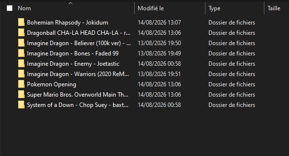
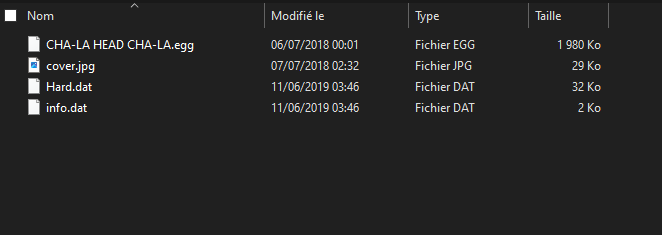

# Open Saber VR 2026

Open Saber VR is an open source clone of the famous and fabulous game Beat Saber. 

    Warning : This fork is based on the first repository of 2018. I'm actually updating and adapting  this project for building its own personality, seek the roadmap below.

Now you would maybe ask yourself what is a Beat Saber clone without any music? Yeah, you are right, it's nothing. But I have some vey good answer to this. Because of the great and wide community of the Beat Saber modders and there custom songs, you can use ANY song from their website and it will work in Open Saber VR. So just go to their websites [BeatSaver](https://beatsaver.com), [BeastSaber](https://bsaber.com) and download any song you want.

## Updates
- First objective was to update the VR management to make it works. So I moved the pipeline to openXR.
- Pause state is here now ! you can pause anytime with the left controller's primary button.

- Now that I finished the Arcade Update, Score, combo and multiplier are tracked live.

- There is a local leaderboard per songs now.

## Import songs
Just download any song from BeatSaver or BeastSaber and unzip it to the "OpenSaberVR_data/Playlists" folder. Make sure that each song has its own folder in the Playlists folder. After that run Open Saber VR and the song should be displayed in the menu. Both the classic (`_notes`) and current v3 (`colorNotes`) map formats are supported.
your Playlist should have folders with your song datas inside like this :

And a song should look, at least, like this :

beware of what you download, sometimes, there is only expert or expert+ difficulty on a song... reason I want to make an editor to make it easier to modify or personalise.

## Gameplay

If you know how to play Beat Saber then you are good to go. If not then it's really simple to play, just cut the notes (beat blocks) at the side where the glow bar is with the saber in the same color. The blue saber is the right hand, the red saber is the left hand. The notes will be only sliced if you hit with the correct saber on the correct side. Otherwise the block will just went through.

There is no energy or anything right now, so you can't "loose" a game, the song will play until the end.

## Features
 - this project sopport V2 songs from BeastSaber and BeatSaber. I'm still working on support for the V3 and V4 songs.
 - arcade-style scoring with combo multiplier (see "Updates in this fork")

## Hints
 - Tested with SteamVR and Meta Quest (via Link/Air Link, using SteamVR or the native Oculus OpenXR runtime). Any OpenXR-compatible headset should work.
 - This is an early development version, so expect some bugs 

## ROADMAP 

Here is the current development roadmap for the OpenSaber VR project overhaul.

### Legend
- `[X]` Completed
- `[O]` In Progress / In Preparation
- `[ ]` Planned

---

## P1: Game Foundations & Core Gameplay
Focusing on finishing off the core mechanics and bringing the game to a fully playable state.

- [X] **Pause Menu**
  - Added a working pause state (time freeze, resume, restart, and return to main menu). Yep, this game didn't have a pause state.

- [X] **Arcade Scoring System**
  - Typical Arcade scoring : you make combos, you earn more points, the better you cut, the better you score !
- [X] **Per-Song Local Leaderboard**
  - Track and display high scores locally per song and difficulty level.
- [O] **V3 Map Format Support**
  - Implementation and handling of V3 beatmap mechanics.
- [ ] **V4 Map Format Support**
  - Integration and backwards compatibility for the latest beatmap specifications.
- [ ] **Hardcore / Fail Mode**
  - Health bar logic (damage taken on missed notes or wrong cuts).
  - Game Over condition and end-of-song summary screen.
  - Custom gameplay modifiers (faster song speed, hidden arrows, smaller sabers).

---

## P2: Customization, Tools & Visual Polish
Enhancing player expression, custom content creation, and visual flair once the core game loop is stable.

- [ ] **Customization Menu (Cosmetics)**
  - **Sabers**: Custom 3D saber models, color selection, blade trail effects, and slice particle effects.
  - **Environments**: Selectable 3D stages, reactive lighting systems (mapping beatmap light events to environment lights).
- [ ] **In-Game / Desktop Song Editor**
  - **Audio & Waveform Engine**: Interactive waveform view, precise BPM calculation, and audio offset adjustment.
  - **Beatmap Grid Layout**: Placement tools for notes, cut directions, bombs, and arcs.
  - **Lightshow Editor**: Dedicated timeline for controlling environment light flashes and laser events.
  - **Metadata & Export**: Export/import custom song packages and manage difficulty variants.

---

## P3: Multiplayer & Networking
Expanding the game experience to online multiplayer competition. I hope the project will survive this long.

- [ ] **Lobby & Room System**
  - Public room browser and private room creation (via room codes).
  - Pre-game lobby UI: Song voting system, host settings, and player "Ready" statuses.
  - Precision time-synchronization engine to ensure accurate simultaneous audio playback across all clients.
- [ ] **Steam Networking Integration**
  - Integration with *Steamworks SDK* for matchmaking, direct lobbies, and peer-to-peer networking.
  - Seamless Steam overlay friend invites.
  - Steam-integrated global and friend leaderboards.
- [ ] **Multiplayer Gameplay & VR Avatar Sync**
  - **Avatar Tracking**: Real-time network synchronization of opponent head and saber position/rotation.
  - **Versus Mode (Battle Royale / Last Man Standing)**
    - Built on top of *Hardcore Mode*: players are eliminated when their health bar reaches zero.
  - **Live Competition HUD**: In-game live leaderboard showing real-time score gaps and placement updates during the song.
  - **Spectator Mode**: Free-cam or player-focused view upon elimination.

## Feedback is welcome 
Feedback is very welcome. If you have questions or ideas, then just leave a mail.

## About me
Well, I'm just a Web Developper diving into Unity beccause I'm looking for another field of Development.